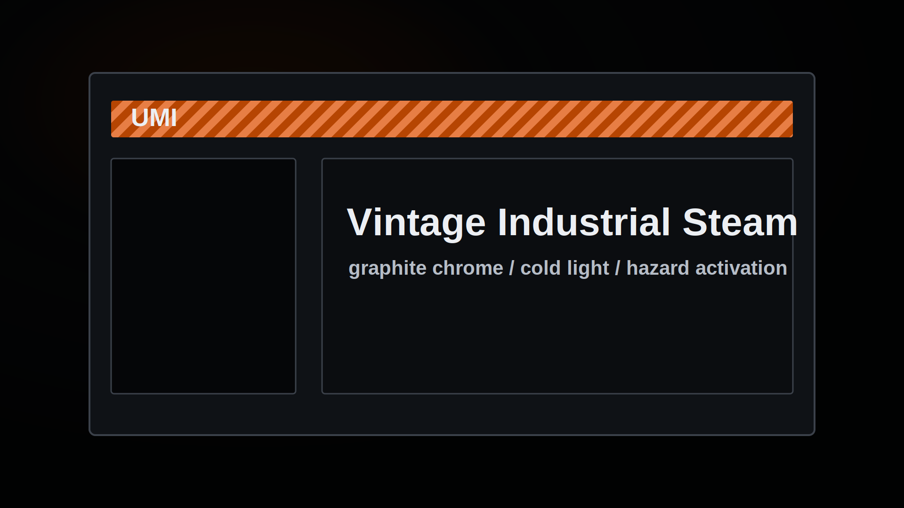

# UMI for Millennium

UMI is a vintage dark industrial theme for the Steam client via [Millennium](https://steambrew.app/). It uses graphite chrome, cold light text, black inset fields, orange-edged steel bevels, scanline grain, and hazard-orange activation states.



## Install

1. Install Millennium from the [Steam Homebrew docs](https://docs.steambrew.app/users/index).
2. Clone this repo into your Millennium skins directory:

```sh
git clone https://github.com/alexh/umi-millennium-theme.git ~/.local/share/Steam/steamui/skins/UMI
```

3. Open Steam, go to `Steam` -> `Millennium` -> `Themes`, then select `UMI`.

For local development, symlink the repo instead:

```sh
ln -s ~/dev/umi-millennium-theme ~/.local/share/Steam/steamui/skins/UMI
```

CSS changes hot-reload through Millennium. JavaScript or `skin.json` changes may require a Steam restart.

## Aesthetic

UMI uses a compact vintage palette:

- Graphite chrome: `#050608`, `#0f1216`, `#14171b`, `#20242a`
- Cold foreground: `#eceff3`, `#b6bdc7`, `#747c88`
- Steel edge highlight: `#3b414a`
- Activation orange: `#ff6700`
- Hazard striping: `#c94a00` and `#ff8a4a`

Orange is reserved for active, selected, focused, and primary action states. Ordinary panels stay dark; fields are near-black with cold light text.

## Structure

This theme uses explicit Millennium patches:

- `webkit.css` loads into all Steam web views.
- `libraryroot.custom.css` and `.js` load into the main Steam window.
- `friends.custom.css` and `.js` load into the Friends UI.
- `bigpicture.custom.css` and `.js` load into Big Picture mode.

`skin.json` uses `Patches` with `MatchRegexString`/`TargetCss`. The global `webkit.css` patch matches every Steam window, and the library stylesheet is explicitly injected for the main Steam window via `^Steam$` and `.DesktopUI`.

## Status

This is an early public extraction from the broader UMI desktop theme. Steam class names change frequently, so selectors may need updates as Steam ships new builds.

## License

MIT. See [LICENSE](LICENSE).
